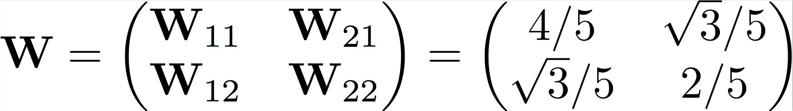

```{r setup, include=FALSE}
require(knitr)
knitr::opts_chunk$set(echo = TRUE)
```


This is a demo for linear neuronal networks. We will simulate the firing rate of two interconnected neurons obeying the simple, linear dynamics.

First we define a function to simulate the network. 

```{r, echo=TRUE}
sim.net <- function(W, Tmax, init, tau=10, dt=1, h=NULL){
  ## inputs: tau * d r / dt = -r + h + Wr
  ## W: weight matrix (square matrix)
  ## Tmax: simulation time (scalar, ms)
  ## init: initial state
  ## tau: time constant
  ## dt: simulation time step (ms)
  ## h: inpit
  ##
  ## output:
  ## the matrix of firing rates
  
  L <- Tmax / dt + 1
  N <- ncol(W)
  resp <- matrix(NA, L, N)
  rr <- init
  resp[1,] <- init

  if (is.null(h)) h <- matrix(0, L, N) # no input
  if (length(h)==N) h <- rbind(rep(h[1], L), rep(h[2], L)) # constant input
  if (nrow(h) != L) stop('input is not specified correctly')
  if (ncol(h) != N) stop('input is not specified correctly')
  
  for (i in 2:L){
  	dr.dt <- (-rr + W %*% rr + h[i,]) / tau
  	rr <- rr + dr.dt * dt
  	resp[i,] <- rr
  }
  resp
}
```

```{r, echo=FALSE}
get.coeff <- function(W, resp){
  L <- nrow(resp)
  eW <- eigen(W)$vec
  N <- ncol(W)
  eResp <- matrix(NA, L, N)
  for (i in 1:L) eResp[i,] <- solve(eW, resp[i,])
  eResp
}
```


The we define the synaptic weights. To make it easier to design networks with a given property, we define the weight matrix by first setting the eigenvalues and then rotating to corresponding ellipse.


```{r, echo=T}
# this is going to be the eigenvalue of the system
lambdas <- c(0.2, 0.7) # use this for slowing
# lambdas <- c(-1, -2) # use this for speeding up
theta <- pi/6 # rotation 
rotate <- matrix(c(cos(theta), sin(theta), -sin(theta), cos(theta)), 2, 2)
vecs <- list(rotate %*% c(1,0), rotate %*% c(0,1))
W <- lambdas[1] * (vecs[[1]] %*% t(vecs[[1]])) + lambdas[2] * (vecs[[2]] %*% t(vecs[[2]]))
W0 <- matrix(0, 2, 2)

## for a non-normal matrix, use this one:
# W <- matrix(c(4, 4, -4.4, -4.4), 2, 2)
```

Finally, we start the system from a given initial condition and simulate the network. We also simulate the same cells without coupling, and illustrate the evolution of the coefficients:


```{r, echo=T, fig.height=5, fig.width=4}

tau <- 100/1000 # time constant, ms
Tmax <- 1 # s
dt <- 0.2/1000 # simulation time step, ms
t <- seq(0, Tmax, by=dt)
init <- c(1, 0)


resp <- sim.net(W, Tmax, init, tau, dt)
resp0 <- sim.net(W0, Tmax, init, tau, dt)

cc <- get.coeff(W, resp)

layout(matrix(c(1,2), 2), 1, c(2,3))
par(mar=c(1,4,3,1))
matplot(t, cc, t="l", col=2, lty=c(1,3), xlab="", axes=F, ylab="c (t)"); axis(2, las=2)

par(mar=c(4,4,0,1))
matplot(t, resp, t="l", col=1, lty=c(1,3), xlab="time (s)", axes=F, ylab="r (t)"); axis(1); axis(2, las=2)
legend('topright', leg=c('cell 1', 'cell 2', 'coupled', 'independent'), lty=c(1,3, 1,1), col=c(1,1,3,1))
matplot(t, resp0, t="l", col=3, lty=c(1,3), add=T)

```

Now let's see the response of the network to some input:

```{r}
Tmax <- 5 # s
dt <- 1/1000 # simulation time step, ms
t <- seq(0, Tmax, by=dt)
init <- c(0, 0)
L <- Tmax / dt + 1
h <- matrix(0, L, 2)
h[201:300,1] <- 1/2
h[1201:1300,2] <- 1/2
h[2201:2300,] <- 1/2
for (i in 1:100) h[(3101:3108) + 8*(i-1),] <- rnorm(1, 0, 1)
h[4101:4900,1] <- sin((1:800)*2*pi/800*5)
matplot(t, h, t='l')
```

```{r}
resp <- sim.net(W, Tmax, init, tau, dt, h=h)
resp0 <- sim.net(W0, Tmax, init, tau, dt, h=h)

cc <- get.coeff(W, resp)

layout(matrix(c(1,2), 2), 1, c(2,3))
par(mar=c(1,4,3,1))
matplot(t, cc, t="l", col=2, lty=c(1,3), xlab="", axes=F, ylab="c (t)"); axis(2, las=2)

par(mar=c(4,4,0,1))
matplot(t, resp, t="l", col=1, lty=c(1,3), xlab="time (s)", axes=F, ylab="r (t)"); axis(1); axis(2, las=2)
legend('topright', leg=c('cell 1', 'cell 2', 'coupled', 'independent'), lty=c(1,3, 1,1), col=c(1,1,3,1), bg=grey(1, alpha=0.5))
matplot(t, resp0, t="l", col=3, lty=c(1,3), add=T)

```

# homework
Assume you have a linear network with the follwing weight matrix: 

```{r, out.width = "40%", echo=FALSE}

```

* What is the activity of the network started from various initial conditions in the absence of external input? How does it react to external inputs?

* What happens if you *slightly* change the lower left element of the connectivity matrix to $W_{22} = 1/5$ or $W_{22} = 3/5$?

* How would you interpret these results? What would be the possible biological function of the original network? Are there any computational or biological problems/challanges associated with it?
